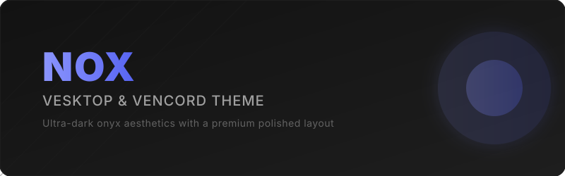
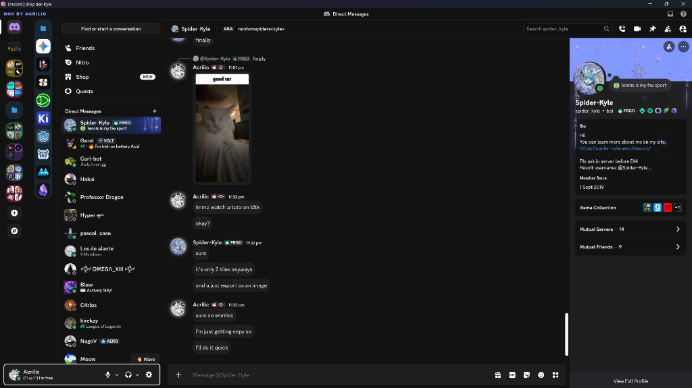

#  Nox

A sleek, premium dark and polished user list theme for Vesktop, Vencord, and BetterDiscord.

**Original Author:** [DevEvil](https://github.com/DevEvil99) ([Dark+](https://github.com/DevEvil99/DarkPlus-Discord-Theme))  
**Customized & Modified by:** [Acrilic](https://github.com/AKRiLLiCK)

---



<div align="center">

<a href="https://raw.githubusercontent.com/AKRiLLiCK/Nox/main/Nox.theme.css" target="_blank">
  
</a>

</div>

---

##  Overview

Nox is a refined, ultra-dark custom stylesheet designed to elevate your Discord client experience with an onyx-inspired visual design, comfortable contrast, and micro-animations.



### Core Enhancements
- **Onyx Aesthetics**: Deep dark `#121212` backgrounds with muted borders and soft translucent highlights.
- **Smart Member List**: The collapsed sidebar expands to `85px` to keep profile pictures visible while hiding usernames and offline groups to save space.
- **Custom Accents**: Branded violet-blue `"NOX BY ACRILIC"` watermark logo in the title bar and blue Discord app badges.

---

##  Installation

### Quick Import
Add this line directly to your client's custom CSS settings:

```css
@import url('https://raw.githubusercontent.com/AKRiLLiCK/Nox/main/Nox.theme.css');
```

### Manual Install
1. Download [Nox.theme.css](./Nox.theme.css) and place it inside your client's themes folder.
2. Enable **Nox** in your client settings.

---

##  License

This project is licensed under the MIT License - see the [LICENSE](./LICENSE) file for details.
